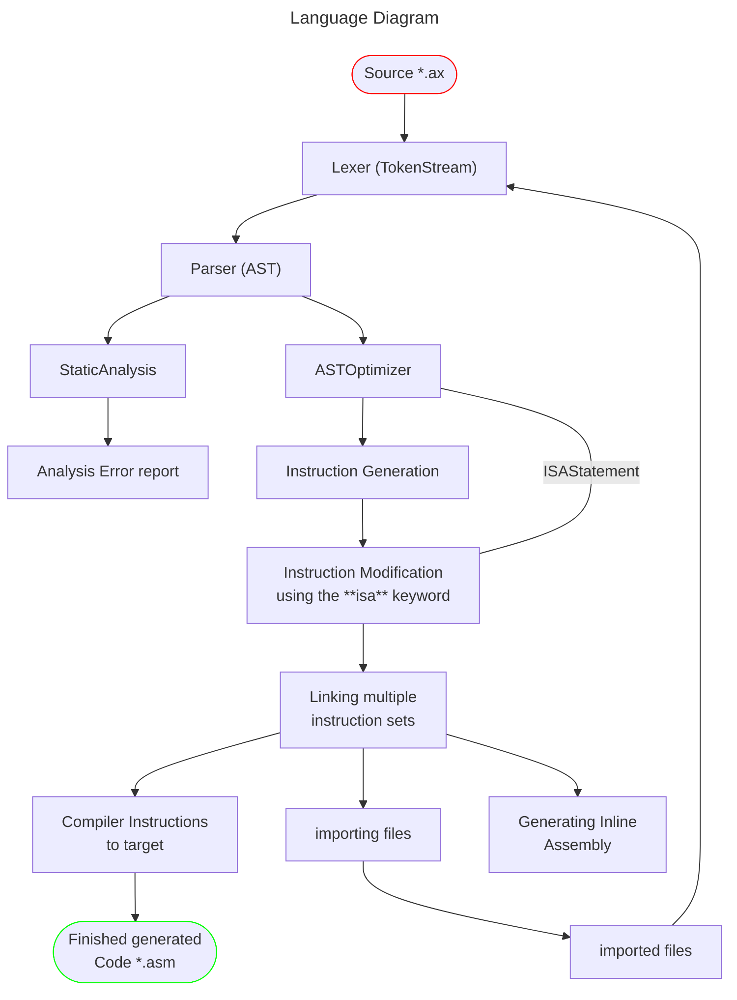

## _*axiol-language*_

- axiol-language is a small hobby language without any dependencies compiling
  to assembly and other different targets. the following readme shows further descriptions
  and documentations to features and general elements of the language.

#### The following symbols show the current state of a feature, syntax or general element:

(✅) This feature is fully implemented and working to current date   
(🚧) This feature is halfway implemented or still in progress   
(❌) This feature is NOT implemented and is still in planing

### Diagram

### Compiler-Targets

| Architecture                              | Supported Sizes | Status |
|-------------------------------------------|-----------------|--------|
| ARM                                       |                 | ❌      |
| THUMB  THUMB_EB                        |                 | ❌      |
| AARCH64  AARCH64_32  AARCH64_BE     |                 | ❌      |
| X86  X86_64                            |                 | ❌      |
| RISCV64  RISCV32                       |                 | ❌      |
| MIPS  MIPS_EL  MIPS64  MIPS64_EL |                 | ❌      |
| PPC32  PPC32_LE  PPC64  PPC64_LE |                 | ❌      |
| SPARC64                                   |                 | ❌      |
| AVR                                       |                 | ❌      |
| IR                                        |                 | ❌      |

#### Documentation 
